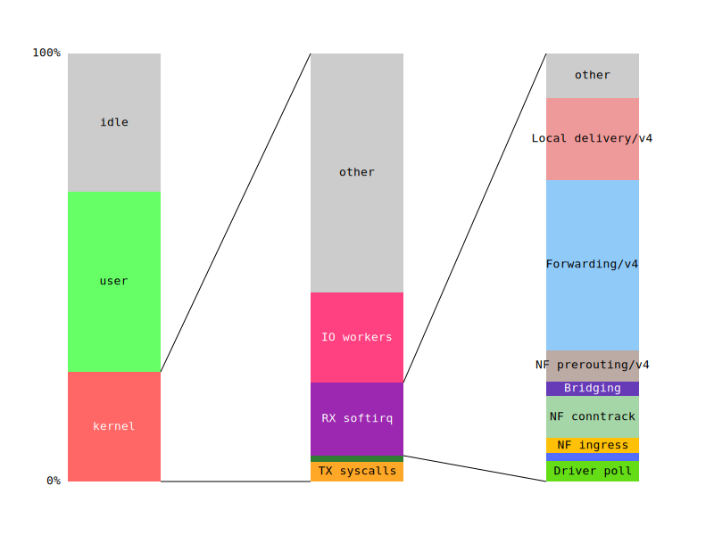

# Netto

_Netto is an eBPF-based network monitoring tool for Linux that measures the CPU cost of the Linux network stack._

## Features

 - Measurement of the on-CPU time of the main networking entry points in kernel
 - Breakdown of the `NET_RX_SOFTIRQ` entry point into the basic network functions by stack trace-based profiling of the kernel
 - Low overhead
 - Real time operation
 - Minimum supported Linux version: **5.11** (`BPF_MAP_TYPE_TASK_STORAGE`)

## Compilation

Building Netto as a standalone application is generally discouraged; users should instead use the provided `Dockerfile` to build a container image that will simplify deployment and management of the tool.

Build Netto into a container image (here tagged "netto") with:

    docker build -t netto https://github.com/miolad/netto.git#perf-event-mmapable-array

Please note that the resulting image will need the `CAP_BPF` \ `CAP_SYS_ADMIN` capability, which under most setups means that the container should be run in `--privileged` mode.

If you'd still prefer to build the tool standalone you'll need:
 - Latest Rust toolchain (stable or nightly)
 - [wasm_pack](https://rustwasm.github.io/wasm-pack/installer/) (for the web frontend)

Compile and run with:
    
    cargo xtask run [--release]

## Usage

    $ ./netto -h
    eBPF-based network diagnosis tool for Linux

    Usage: netto [OPTIONS]
    
    Options:
      -f, --frequency <FREQUENCY>      Perf-event's sampling frequency in Hz for the NET_RX_SOFTIRQ cost breakdown     [default: 1000]
      -a, --address <ADDRESS>          Bind address for the web frontend [default: 0.0.0.0]
      -p, --port <PORT>                Bind port for the web frontend [default: 8080]
          --user-period <USER_PERIOD>  User-space controller update period in ms [default: 500]
      -l, --log-file <LOG_FILE>        Path to a log file to which measurements are to be saved. If logging is enabled by providing this argument, any other form of web interface will be disabled
      -P, --prometheus                 Enable Prometheus logging in place of the web interface. The Prometheus-compatible endpoint will be available at `http://address:port`
      -h, --help                       Print help
      -V, --version                    Print version

## Deployment

By default, Netto exposes the real time results as a Wasm-powered web page accessible on `http://address:port`. This interface is ideal for consuming the content as it is produced, but does not provide out-of-the-box support for storing the extracted metrics for delayed access.
When real time monitoring of the host is not the primary concern, and to better integrate with existing metrics collection stacks (such as in data center environments), it is recommended to instead replace the built-in custom web frontend with a Prometheus-based exporter with the `-P` (or `--prometheus`) command line option.

In most cases the recommended way to run Netto involves a command similar to:

    docker run --name netto --privileged --restart unless-stopped -d -p 8080:8080 netto -P

Or with the equivalent `docker compose` configuration entry:

    services:
        netto:
            build: https://github.com/miolad/netto.git#perf-event-mmapable-array
            image: netto
            container_name: netto
            privileged: true
            command: -P
            restart: unless-stopped
        ...

## Integration with Grafana

With the `-P` option selected, Netto can be targeted by the Prometheus scraper and referenced in Grafana directly.
An example dashboard that showcases the major metrics collected by Netto is available as `grafana_dashboard.json` (which assumes that the variable "host" is used to differentiate between different monitored hosts through the Prometheus "job" label, to be configured in Prometheus' settings).

## Repository structure

| Folder | Contents |
| - | - |
| `images` | Images used on this `README` |
| `netto` | Main Rust binary crate |
| `netto/src/bpf` | BPF-C programs |
| `metrics-common` | Bridge Rust library crate for `main` and `web-frontend` |
| `web-frontend` | Rust WebAssembly frontend |
| `www` | Static files for the web frontend |
| `xtask` | Utility binary crate for managing coordination between the other crates |
