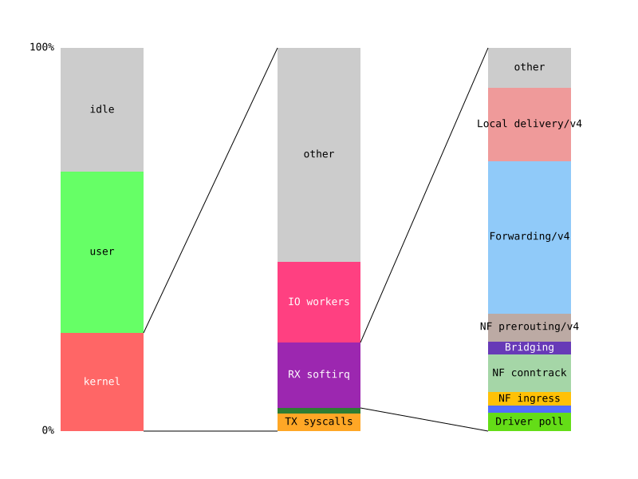

# Netto

_Netto is an eBPF-based network monitoring tool for Linux that measures the CPU cost of the Linux network stack._

## Features

 - Measurement of the on-CPU time of the main networking entry points in kernel
 - Breakdown of the `NET_RX_SOFTIRQ` entry point into the basic network functions by stack trace-based profiling of the kernel
 - Low overhead
 - Real time operation
 - Minimum supported Linux version: **5.11** (`BPF_MAP_TYPE_TASK_STORAGE`)

## Compilation

Building Netto as a standalone application is generally discouraged; users should instead use the provided `Dockerfile` to build a container image that will simplify deployment and management of the tool.

Build Netto into a container image (here tagged "netto") with:

    docker build -t netto https://github.com/miolad/netto.git#perf-event-mmapable-array

Please note that the resulting image will need the `CAP_BPF` \ `CAP_SYS_ADMIN` capability, which under most setups means that the container should be run in `--privileged` mode.

If you'd still prefer to build the tool standalone you'll need:
 - Latest Rust toolchain (stable or nightly)
 - [wasm_pack](https://rustwasm.github.io/wasm-pack/installer/) (for the web frontend)

Compile and run with:
    
    cargo xtask run [--release]

## Usage

    $ ./netto -h
    eBPF-based network diagnosis tool for Linux

    Usage: netto [OPTIONS]

    Options:
      -f, --frequency <FREQUENCY>      Perf-event's sampling frequency in Hz for the NET_RX_SOFTIRQ cost breakdown [default: 1000]
      -a, --address <ADDRESS>          Address of the Grafana Pyroscope backend [default: pyroscope]
      -p, --port <PORT>                Port for the Grafana Pyroscope backend to listen on [default: 4040]
          --user-period <USER_PERIOD>  User-space controller update period in ms [default: 500]
      -l, --log-file <LOG_FILE>        Path to a log file to which measurements are to be saved. If logging is enabled by providing this   argument, any other form of web interface will be disabled
      -P, --prometheus                 Enable Prometheus logging in place of the web interface. The Prometheus-compatible endpoint will   be available at `http://address:port`
      -u, --user-pids <USER_PIDS>      List of PIDs of which to track the user-space CPU time via procfs
      -h, --help                       Print help
      -V, --version                    Print version

## Deployment

Netto exposes the real time results to a Grafana Pyroscope endpoint (`http://pyroscope:4040` by default, configurable through the `-a` and `-p` CLI arguments). Pyroscope allows for unfiltered, direct access to the raw flamegraph-like data generation that is provided by Netto.

The recommended way to run Netto is demonstrated in the provided `docker-compose.yml` file: it will deploy the a privileged Netto container alongside both the Pyroscope and Grafana server. Additionally, a sample Grafana dashboard is provisioned.

After starting the deployment (`docker compose up -d`), the Grafana service can be accessed at `http://localhost:3000`.

## Repository structure

| Folder | Contents |
| - | - |
| `images` | Images used on this `README` |
| `netto` | Main Rust binary crate |
| `netto/src/bpf` | BPF-C programs |
| `metrics-common` | Bridge Rust library crate for `main` and `web-frontend` |
| `web-frontend` | Rust WebAssembly frontend |
| `www` | Static files for the web frontend |
| `xtask` | Utility binary crate for managing coordination between the other crates |

## Acknowledgements

This work has been partially supported by:
* the [ELASTIC project](https://elasticproject.eu/), which received funding from the [Smart Networks and Services Joint Undertaking](https://smart-networks.europa.eu/) (SNS JU) under the European Union’s [Horizon Europe](https://research-and-innovation.ec.europa.eu/funding/funding-opportunities/funding-programmes-and-open-calls/horizon-europe_en) research and innovation programme under [Grant Agreement No. 101139067](https://cordis.europa.eu/project/id/101139067). Views and opinions expressed are however those of the author(s) only and do not necessarily reflect those of the European Union. Neither the European Union nor the granting authority can be held responsible for them.
* the European Union - Next Generation EU under the Italian National Recovery and Resilience Plan (NRRP), Mission 4, Component 2, Investment 1.3, CUP E13C22001870001, partnership on "Telecommunications of the Future" (PE00000001 - program "RESTART").
